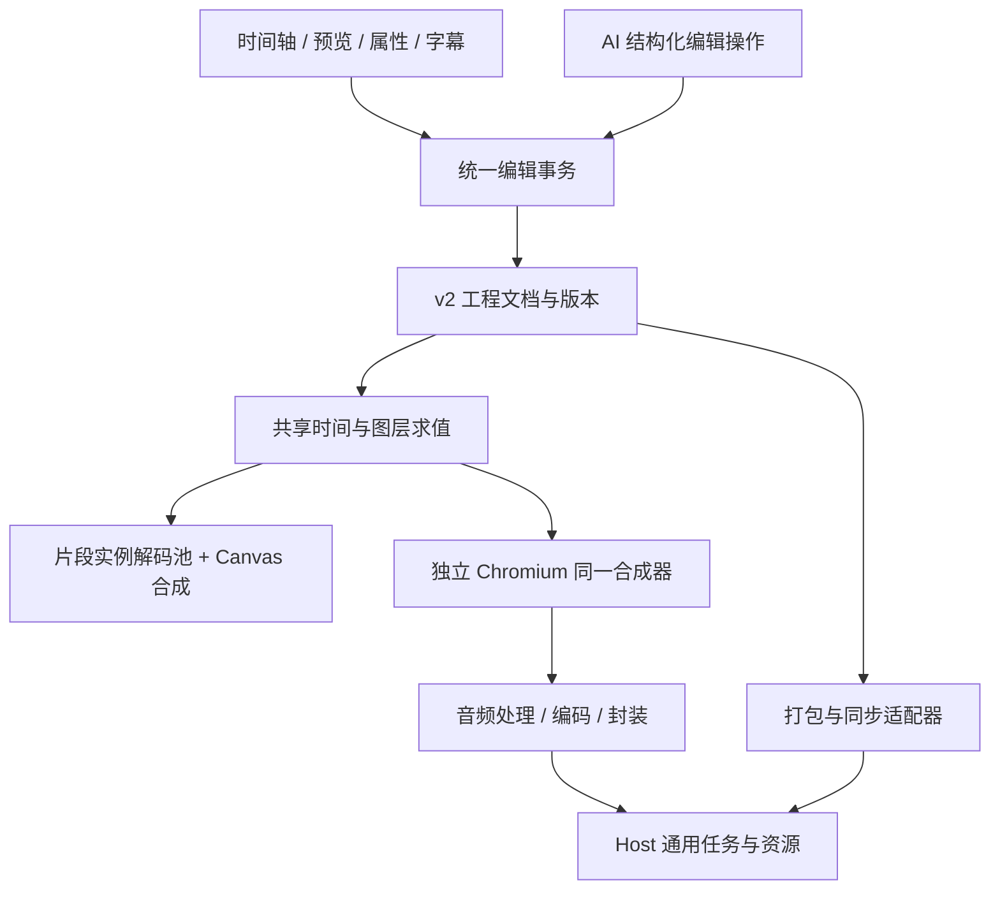

# Video Studio v2：统一工程、时间轴与渲染架构

日期：2026-09-15；验收更新：2026-09-16。状态：0.6.0 本轮范围已实现并验证，逐项清单见根目录 TODO.md。

## 范围与边界

本轮实现精剪、构图、多轨、参数动画、变速、转场/调色/手动蒙版、字幕、声音、波形图条、多序列/多机位及导出/同步。AI 画面处理和在线素材模板市场延后。架构保留它们的派生素材与目录适配入口，不能将仅有入口标为已经支持。

所有工程模型、编辑规则、字幕/音频流程、编解码参数与本地处理工具归视频面板。Host 只提供授权、资源与任务生命周期。现有 Host 持久任务有输入数量和大小限制，面板按当前序列的依赖闭包分批准备资源，通过小型清单交给任务；不把所有原片或工程大对象塞进 IPC。

## 总体结构

## 1. 权威工程

`editor/types.ts` 定义 `EditorDocument`：一个素材目录、多条序列、活动序列 ID 和导出预设。每条序列独立设置画布、帧率、轨道顺序、片段、转场、标记。视频、音频、文字等片段显式引用轨道；同一素材的多次使用具有不同实例 ID。

v2 文档是唯一编辑权威。旧工程通过确定性迁移进入 v2；兼容适配器可以为旧的录制/粗剪工具提供读视图，但不得另存一份可独立修改的活动序列。迁移保存原 ID、原声、字幕、空隙、配音配方和制作单；启用新版前保留原工程快照。

工程中媒体只保存逻辑 ID、内容指纹、元数据和配方，不保存可执行表达式或将本地路径当成权限。导出/同步在授权边界解析资源。

## 2. 时间与变速

使用 **每秒 240000 个整数刻度**。该时间基准能精确表示常用整数帧率、24000/1001、30000/1001、60000/1001，以及 48 kHz 音频采样；其他采样率在编码边界有理换算并明确取整。

- `FrameRate` 保存分子/分母；帧数只用于用户显示、帧对齐与输出采样。
- 旧工程的源帧是归一化 30fps 时间，每帧转换为 8000 刻度；修改输出 fps 不修改源范围。
- 片段保存独立的时间轴起点、时长和 `TimeMap`。映射点连接局部输出时间与源时间；正向、反向、保持分别表示正常播放、倒放和定格。
- 曲线变速编辑器将速度积分成时间映射；波形、字幕、预览和音频统一调用映射函数。映射不是将某个媒体播放器的时间当成工程播放头。
- 区间采用左闭右开。切分与裁剪显式插入边界映射点，保留准确的源时间与动画边界。

## 3. 命令与历史

所有人工和 AI 编辑使用同一批次命令：轨道/片段/关键帧/转场/序列/标记的新增、更新、删除、切分和成组操作。每批校验工程 ID、baseRevision、资源引用、轨道锁定和跨对象约束；整批成功只增加一次修订，失败不写入任何局部结果。

撤销按批次保存前后状态/逆命令。多选和剪贴板是会话状态；粘贴生成新实例 ID，保持相对位置和关联字幕/动画。锁定、隐藏和静音分别控制编辑、画面和声音，不能互相代替。

## 4. 共享求值与合成

`evaluateFrame(document, sequenceId, tick)` 返回有序图层、每个实例的源时间、变换、文字、颜色/蒙版、转场权重与音频参数，不依赖 DOM、路径或 FFmpeg。

`compositor` 接收求值结果及媒体画面，负责唯一一套构图、文字排版、滤镜、蒙版、混合与转场绘制。原生离线导出在独立 Chromium 中运行同一合成器，每个输出帧等待所需媒体准备完成再编码。FFmpeg 负责输入兼容、音频时间处理、混音与封装，不另写一套不同的画面语义。

预览使用工程主时钟。视频解码池按片段实例分配，支持同一原片在不同轨道和不同源时间同时出现；仅保留当前可见层和有限预读，隐藏面板释放缓冲。转场同时求值两端，不通过猜测相邻素材实现。

任何优化快路径必须与共享求值结果等价，并通过同工程像素/音频对比；不能绕过未实现的效果静默输出。

## 5. 字幕与声音

字幕和自由文字共用排版属性，但字幕保存来源绑定、词级时间和翻译状态。通用字幕入口枚举实际可听见的主画面及独立音轨，再映射源时间；专门本人录音审稿流程继续保留审批与字幕归属。

音频计划使用同一 TimeMap 和参数动画，组合片段/轨道音量、声道平衡、淡入淡出和侧链压低。人声分离等处理生成新素材并记录配方；原始素材保留。静音定格和反向声音的默认行为在属性中明确，可人工调整。

## 6. 多序列与多机位

嵌套序列片段引用序列 ID，禁止引用环。多机位组保存原素材、同步偏移、机位切换点与主音频机位；声音对齐结果需显示偏移和置信度，允许人工修正。切换画面不切断连续主音轨。导出展开当前序列的真实依赖闭包。

## 7. 导出与同步

导出预设独立保存分辨率、有理帧率、容器/编码器、质量或码率及音频设置。启动前检测实际编码器能力，完成后读取真实输出核验尺寸、编码、帧率、时长、声音。批量任务分别保存输入修订与预设，失败只重试对应结果。

便携工程包包含完整文档、内容寻址的原媒体和哈希清单；导入校验后重新登记到当前工作区，原工作区资源 ID 不直接复用。当前格式保留字体名称和样式，但不携带系统字体；跨设备需要安装相同字体，面板提示可能缺失的字体。

同步采用不可变快照及父版本，分歧产生冲突分支，不以最后写入覆盖用户编辑。遵照用户偏好，优先保持工程和媒体交换格式相通，服务可替换。当前目录适配器连接用户选定的外部同步存储。同步盘传输由真实同步服务负责，面板负责包、版本、状态与恢复；本地自动保存不称为跨设备同步。需要网络凭据时使用适当的凭据能力，不把密码写进工程。

## 实施顺序与证据

1. 冻结基线与完整清单；修复独立配音字幕；共享时间、动画、v2 schema 与迁移。
2. 原子编辑事务、v2 运行时适配、解码池、合成器和真实离线输出，先做到旧工程等价。
3. 多选/分组、构图/多轨、关键帧/变速、转场/调色/蒙版、文字/音频，每项同时接界面和输出。
4. 波形/图条/标记、多序列/多机位、批量导出、工程包与真实同步。
5. 完整原流程回归、安装验证、逐条验收；只在全部非延后项目有足够证据时完成目标。

必须覆盖：同源双轨不同源时间、转场中点、旋转/蒙版边缘、中文换行与字体、变速后的字幕和声音、NTSC 长片无漂移、倒放边界、定格音频、跨序列引用环、导出取消清理、同步冲突、原 0.5.15 工程与声音库恢复。

## 同步偏好补充（用户确认）

优先保证工程与素材包格式相通，服务选择次要。交换文件使用公开且版本化的格式；以内容哈希标识媒体、用相对引用重建素材关系，附完整性校验和迁移规则。当前连接用户选择的同步目录；未来 WebDAV 等适配器也应只负责传输同一种快照，不改变编辑文档，也不把授权路径或服务凭据写进可交换工程。跨设备恢复和冲突处理必须实际验证。
